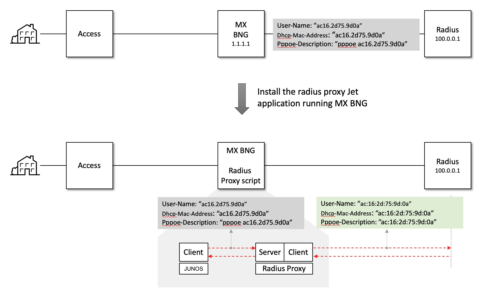

### Radius proxy

## Overview

This script acts as a RADIUS proxy, converting RADIUS attributes, including the MAC address format to `xx:xx:xx:xx:xx:xx`. It uses the Juniper VSA `DHCP-Options (26-4874-55)` to distinguish DHCP user sessions from PPPoE sessions.


#### Affected attributes
| **RADIUS Attribute**             | **DHCP Session**  | **PPPoE Session**          |
|-----------------------------------|-------------------|----------------------------|
| User-Name (1)                     | `xx:xx:xx:xx:xx:xx` | Bypassed                  |
| Dhcp-Mac-Address (26-4874-56)     | `xx:xx:xx:xx:xx:xx` | `xx:xx:xx:xx:xx:xx`       |
| Pppoe-Description (26-4874-24)    | `xx:xx:xx:xx:xx:xx` | `xx:xx:xx:xx:xx:xx`       |


## Supported RADIUS Messages
| **Message Type**                 | **Supported?** |
|-----------------------------------|----------------|
| Access-Request                    | Yes            |
| Accounting-Request (Start)        | Yes            |
| Accounting-Request (Interim)      | Yes            |
| CoA Request                       | No             |
| Disconnect Request                | No             |




## Input Arguments

The RADIUS proxy application supports the following options:

1. **`-t`**: Timeout value for the customer's RADIUS server response (default: 3 seconds).  
2. **`-m`**: Mapping entries for the RADIUS proxy. Multiple entries can be specified using a comma separator (`,`).  
   Format:  
   ```plaintext
   <local-ip>:<local-port>-<remote-ip>:<remote-port>-<radius-secret>, ...
   ```
   Example:
   ```plaintext
   1.1.1.1:11812-10.0.0.1:1812-juniper
   ```

   - Unlimited entries can be added.
   - For redundancy, copy and rename `jrp.py` for different configurations:
     - `jrp1.py` for `1.1.1.1:11812-10.0.0.1:1812-juniper`
     - `jrp2.py` for `1.1.1.1:11813-10.0.0.1:1813-juniper`

   - **Secret Key**: Accepts a plain string or a JUNOS encrypted format (prefixed by `$9$`).

 
## Installation Steps

1. **Copy the Script**  
   Transfer `jrp.py` to the MX BNG system:
   ```sh
   scp jrp.py user@bng1:
   ```

2. **Register the Script**  
   Register the script in the JET application with the required arguments:
   ```sh
   request system scripts refresh-from extension-service file jrp.py url /var/home/user/jrp.py
   ```

3. **Update JUNOS Configuration**  
   Add/update the RADIUS client configuration to point to the RADIUS proxy server:
   ```sh
   edit
   set system scripts language python3
   set system extensions extension-service application file jrp.py arguments "<arguments>"
   set access radius-server 1.1.1.1 secret "$9$<encrypted-key>"
   ```

---

## Example JUNOS Configuration

```sh
set system extensions extension-service application file jrp.py {
    arguments "-m 1.1.1.1:1812-10.0.0.1:1812-$9$encrypted-key,1.1.1.1:1813-10.0.0.1:1813-$9$encrypted-key";
    daemonize;
    respawn-on-normal-exit;
    username root;
}
set interfaces lo0 unit 0 family inet address 1.1.1.1/32
set access radius-server 1.1.1.1 {
    port 1812;
    accounting-port 1813;
    secret "$9$encrypted-key";
    source-address 1.1.1.1;
}
set access profile freeradius {
    authentication-order radius;
    radius {
        authentication-server 1.1.1.1;
        accounting-server 1.1.1.1;
    }
}
```


## FreeRADIUS Accounting Data
```sh
Tue Mar 23 13:51:45 2021
	User-Name = "juniper"
	Acct-Status-Type = Start
	Acct-Session-Id = "61"
	Event-Timestamp = "Mar 23 2021 13:50:39 EDT"
	Acct-Delay-Time = 0
	Service-Type = Framed-User
	Framed-Protocol = PPP
	Attr-26.4874.177 = 0x506f72742073706565643a20313030303030306b
	Acct-Authentic = RADIUS
	ERX-Dhcp-Mac-Addr = "ac:16:2d:75:9d:0a"
	Framed-IP-Address = 203.0.0.10
	Framed-IP-Netmask = 255.255.255.255
	NAS-Identifier = "petrel1"
	NAS-Port = 805306568
	NAS-Port-Id = "ge-3/1/0.demux0.3221225522:100-200"
	NAS-Port-Type = Ethernet
	ERX-Virtual-Router-Name = "default:default"
	ERX-Pppoe-Description = "ac:16:2d:75:9d:0a"
	Attr-26.4874.210 = 0x00000004
	NAS-IP-Address = 1.1.1.1
	Tmp-String-9 = "ai:"
	Acct-Unique-Session-Id = "c6972b3b7c5abe21400063b1fc3680e6"
	Timestamp = 1616521905

Tue Mar 23 13:53:03 2021
	User-Name = "juniper"
	Acct-Status-Type = Stop
	Acct-Session-Id = "61"
	Event-Timestamp = "Mar 23 2021 13:51:56 EDT"
	Acct-Input-Octets = 190
	Acct-Output-Octets = 30
	Acct-Session-Time = 77
	Acct-Input-Packets = 5
	Acct-Output-Packets = 6
	Acct-Terminate-Cause = Lost-Carrier
	Acct-Delay-Time = 0
	Service-Type = Framed-User
	Framed-Protocol = PPP
	Acct-Authentic = RADIUS
	ERX-Dhcp-Mac-Addr = "ac:16:2d:75:9d:0a"
	Framed-IP-Address = 203.0.0.10
	Framed-IP-Netmask = 255.255.255.255
	ERX-Input-Gigapkts = 0
	Acct-Input-Gigawords = 0
	NAS-Identifier = "petrel1"
	NAS-Port = 805306568
	NAS-Port-Id = "ge-3/1/0.demux0.3221225522:100-200"
	NAS-Port-Type = Ethernet
	ERX-Output-Gigapkts = 0
	Acct-Output-Gigawords = 0
	ERX-IPv6-Acct-Input-Octets = 0
	ERX-IPv6-Acct-Output-Octets = 0
	ERX-IPv6-Acct-Input-Packets = 0
	ERX-IPv6-Acct-Output-Packets = 0
	ERX-IPv6-Acct-Input-Gigawords = 0
	ERX-IPv6-Acct-Output-Gigawords = 0
	ERX-Virtual-Router-Name = "default:default"
	ERX-Pppoe-Description = "ac:16:2d:75:9d:0a"
	NAS-IP-Address = 1.1.1.1
	Tmp-String-9 = "ai:"
	Acct-Unique-Session-Id = "c6972b3b7c5abe21400063b1fc3680e6"
	Timestamp = 1616521983

Tue Mar 23 13:53:51 2021
	User-Name = "ac:16:2d:75:9d:0a"
	Acct-Status-Type = Start
	Acct-Session-Id = "63"
	Event-Timestamp = "Mar 23 2021 13:52:44 EDT"
	Acct-Delay-Time = 0
	Service-Type = Framed-User
	Acct-Authentic = RADIUS
	ERX-Dhcp-Options = 0x3501013204cb000005370d011c02790f060c28292a1a7703
	ERX-Dhcp-Mac-Addr = "ac:16:2d:75:9d:0a"
	Framed-IP-Address = 203.0.0.5
	Framed-IP-Netmask = 255.255.255.0
	NAS-Identifier = "petrel1"
	NAS-Port = 805306568
	NAS-Port-Id = "ge-3/1/0.demux0.3221225524:100-200"
	NAS-Port-Type = Ethernet
	ERX-Virtual-Router-Name = "default:default"
	ERX-Pppoe-Description = "ac:16:2d:75:9d:0a"
	Attr-26.4874.189 = 0xcb000001
	Attr-26.4874.210 = 0x00000004
	NAS-IP-Address = 1.1.1.1
	Tmp-String-9 = "ai:"
	Acct-Unique-Session-Id = "35a759cd80c000b23127a7f59ef0716f"
	Timestamp = 1616522031

Tue Mar 23 13:54:38 2021
	User-Name = "ac:16:2d:75:9d:0a"
	Acct-Status-Type = Stop
	Acct-Session-Id = "63"
	Event-Timestamp = "Mar 23 2021 13:53:31 EDT"
	Acct-Input-Octets = 1176
	Acct-Output-Octets = 927
	Acct-Session-Time = 47
	Acct-Input-Packets = 18
	Acct-Output-Packets = 16
	Acct-Terminate-Cause = User-Request
	Acct-Delay-Time = 0
	Service-Type = Framed-User
	Acct-Authentic = RADIUS
	ERX-Dhcp-Options = 0x3501013204cb000005370d011c02790f060c28292a1a7703
	ERX-Dhcp-Mac-Addr = "ac:16:2d:75:9d:0a"
	Framed-IP-Address = 203.0.0.5
	Framed-IP-Netmask = 255.255.255.0
	ERX-Input-Gigapkts = 0
	Acct-Input-Gigawords = 0
	NAS-Identifier = "petrel1"
	NAS-Port = 805306568
	NAS-Port-Id = "ge-3/1/0.demux0.3221225524:100-200"
	NAS-Port-Type = Ethernet
	ERX-Output-Gigapkts = 0
	Acct-Output-Gigawords = 0
	ERX-IPv6-Acct-Input-Octets = 0
	ERX-IPv6-Acct-Output-Octets = 0
	ERX-IPv6-Acct-Input-Packets = 0
	ERX-IPv6-Acct-Output-Packets = 0
	ERX-IPv6-Acct-Input-Gigawords = 0
	ERX-IPv6-Acct-Output-Gigawords = 0
	ERX-Virtual-Router-Name = "default:default"
	ERX-Pppoe-Description = "ac:16:2d:75:9d:0a"
	Attr-26.4874.189 = 0xcb000001
	NAS-IP-Address = 1.1.1.1
	Tmp-String-9 = "ai:"
	Acct-Unique-Session-Id = "35a759cd80c000b23127a7f59ef0716f"
	Timestamp = 1616522078


## Log Monitoring

Monitor logs for debugging:
```sh
tail -f /var/log/jrp.log
```

Sample Log:
```plaintext
tail -f /var/log/jrp.log
2021-03-23 17:50:22.137 INFO 369: **********************
2021-03-23 17:50:22.137 INFO 370: radius proxy starts!!!
2021-03-23 17:50:22.138 INFO 371: **********************
2021-03-23 17:50:22.138 DEBUG 372: arguments: ['/var/run/scripts/jet//jrp.py', '-m', '1.1.1.1:1812-10.0.0.1:1812-$9$JfUi.QF/0BEP5BEcyW8ZUj,1.1.1.1:1813-10.0.0.1:1813-$9$JfUi.QF/0BEP5BEcyW8ZUj']
2021-03-23 17:50:22.141 DEBUG 390: proxy mapping: 1.1.1.1:1812 <==> 10.0.0.1:1812 : $9$JfUi.QF/0BEP5BEcyW8ZUj
2021-03-23 17:50:22.143 DEBUG 390: proxy mapping: 1.1.1.1:1813 <==> 10.0.0.1:1813 : $9$JfUi.QF/0BEP5BEcyW8ZUj
2021-03-23 17:50:38.367 DEBUG 313: access-request id: 211 pppoe-session: "ac16.2d75.9d0a" -> "ac:16:2d:75:9d:0a"
2021-03-23 17:50:38.667 DEBUG 313: accounting-request id: 212 pppoe-session: "ac16.2d75.9d0a" -> "ac:16:2d:75:9d:0a"
2021-03-23 17:51:56.167 DEBUG 313: accounting-request id: 213 pppoe-session: "ac16.2d75.9d0a" -> "ac:16:2d:75:9d:0a"
2021-03-23 17:52:43.826 DEBUG 309: access-request id: 214 dhcp-session: "ac16.2d75.9d0a" -> "ac:16:2d:75:9d:0a"
2021-03-23 17:52:44.130 DEBUG 309: accounting-request id: 215 dhcp-session: "ac16.2d75.9d0a" -> "ac:16:2d:75:9d:0a"
2021-03-23 17:52:52.167 DEBUG 313: access-request id: 216 pppoe-session: "ac16.2d75.9d0a" -> "ac:16:2d:75:9d:0a"
2021-03-23 17:52:52.367 DEBUG 313: accounting-request id: 217 pppoe-session: "ac16.2d75.9d0a" -> "ac:16:2d:75:9d:0a"
2021-03-23 17:53:19.567 DEBUG 313: accounting-request id: 218 pppoe-session: "ac16.2d75.9d0a" -> "ac:16:2d:75:9d:0a"
2021-03-23 17:53:31.116 DEBUG 309: accounting-request id: 219 dhcp-session: "ac16.2d75.9d0a" -> "ac:16:2d:75:9d:0a"

```

#### Software version
##### JUNOS
```sh
user@bng1# run show version 
Hostname: bng1
Model: mx480
Junos: 20.2R1.10
JUNOS OS Kernel 64-bit  [20200608.0016468_builder_stable_11]
JUNOS OS libs [20200608.0016468_builder_stable_11]
JUNOS OS runtime [20200608.0016468_builder_stable_11]
JUNOS OS time zone information [20200608.0016468_builder_stable_11]
JUNOS network stack and utilities [20200625.123713_builder_junos_202_r1]
JUNOS libs [20200625.123713_builder_junos_202_r1]
JUNOS OS libs compat32 [20200608.0016468_builder_stable_11]
JUNOS OS 32-bit compatibility [20200608.0016468_builder_stable_11]
JUNOS libs compat32 [20200625.123713_builder_junos_202_r1]
JUNOS runtime [20200625.123713_builder_junos_202_r1]
JUNOS sflow mx [20200625.123713_builder_junos_202_r1]
JUNOS py extensions2 [20200625.123713_builder_junos_202_r1]
JUNOS py extensions [20200625.123713_builder_junos_202_r1]
JUNOS py base2 [20200625.123713_builder_junos_202_r1]
JUNOS py base [20200625.123713_builder_junos_202_r1]
JUNOS OS crypto [20200608.0016468_builder_stable_11]
JUNOS na telemetry [20.2R1.10]
JUNOS Security Intelligence [20200625.123713_builder_junos_202_r1]
JUNOS mx libs compat32 [20200625.123713_builder_junos_202_r1]
JUNOS mx runtime [20200625.123713_builder_junos_202_r1]
JUNOS RPD Telemetry Application [20.2R1.10]
Redis [20200625.123713_builder_junos_202_r1]
JUNOS common platform support [20200625.123713_builder_junos_202_r1]
JUNOS Openconfig [20.2R1.10]
JUNOS mtx network modules [20200625.123713_builder_junos_202_r1]
JUNOS modules [20200625.123713_builder_junos_202_r1]
JUNOS mx modules [20200625.123713_builder_junos_202_r1]
JUNOS mx libs [20200625.123713_builder_junos_202_r1]
JUNOS SQL Sync Daemon [20200625.123713_builder_junos_202_r1]
JUNOS mtx Data Plane Crypto Support [20200625.123713_builder_junos_202_r1]
JUNOS daemons [20200625.123713_builder_junos_202_r1]
JUNOS mx daemons [20200625.123713_builder_junos_202_r1]
JUNOS appidd-mx application-identification daemon [20200625.123713_builder_junos_202_r1]
JUNOS Services URL Filter package [20200625.123713_builder_junos_202_r1]
JUNOS Services TLB Service PIC package [20200625.123713_builder_junos_202_r1]
JUNOS Services Telemetry [20200625.123713_builder_junos_202_r1]
JUNOS Services TCP-LOG [20200625.123713_builder_junos_202_r1]
JUNOS Services SSL [20200625.123713_builder_junos_202_r1]
JUNOS Services SOFTWIRE [20200625.123713_builder_junos_202_r1]
JUNOS Services Stateful Firewall [20200625.123713_builder_junos_202_r1]
JUNOS Services RTCOM [20200625.123713_builder_junos_202_r1]
JUNOS Services RPM [20200625.123713_builder_junos_202_r1]
JUNOS Services PCEF package [20200625.123713_builder_junos_202_r1]
JUNOS Services NAT [20200625.123713_builder_junos_202_r1]
JUNOS Services Mobile Subscriber Service Container package [20200625.123713_builder_junos_202_r1]
JUNOS Services MobileNext Software package [20200625.123713_builder_junos_202_r1]
JUNOS Services Logging Report Framework package [20200625.123713_builder_junos_202_r1]
JUNOS Services LL-PDF Container package [20200625.123713_builder_junos_202_r1]
JUNOS Services Jflow Container package [20200625.123713_builder_junos_202_r1]
JUNOS Services Deep Packet Inspection package [20200625.123713_builder_junos_202_r1]
JUNOS Services IPSec [20200625.123713_builder_junos_202_r1]
JUNOS Services IDS [20200625.123713_builder_junos_202_r1]
JUNOS IDP Services [20200625.123713_builder_junos_202_r1]
JUNOS Services HTTP Content Management package [20200625.123713_builder_junos_202_r1]
JUNOS Services Crypto [20200625.123713_builder_junos_202_r1]
JUNOS Services Captive Portal and Content Delivery Container package [20200625.123713_builder_junos_202_r1]
JUNOS Services COS [20200625.123713_builder_junos_202_r1]
JUNOS AppId Services [20200625.123713_builder_junos_202_r1]
JUNOS Services Application Level Gateways [20200625.123713_builder_junos_202_r1]
JUNOS Services AACL Container package [20200625.123713_builder_junos_202_r1]
JUNOS SDN Software Suite [20200625.123713_builder_junos_202_r1]
JUNOS Extension Toolkit [20200625.123713_builder_junos_202_r1]
JUNOS Packet Forwarding Engine Support (wrlinux9) [20200625.123713_builder_junos_202_r1]
JUNOS Packet Forwarding Engine Support (MXSPC3) [20.2R1.10]
JUNOS Packet Forwarding Engine Support (MX/EX92XX Common) [20200625.123713_builder_junos_202_r1]
JUNOS Packet Forwarding Engine Support (M/T Common) [20200625.123713_builder_junos_202_r1]
JUNOS Packet Forwarding Engine Support (aft) [20200625.123713_builder_junos_202_r1]
JUNOS Packet Forwarding Engine Support (MX Common) [20200625.123713_builder_junos_202_r1]
JUNOS Juniper Malware Removal Tool (JMRT) [1.0.0+20200625.123713_builder_junos_202_r1]
JUNOS J-Insight [20200625.123713_builder_junos_202_r1]
JUNOS jfirmware [20200625.123713_builder_junos_202_r1]
JUNOS Online Documentation [20200625.123713_builder_junos_202_r1]
JUNOS jail runtime [20200608.0016468_builder_stable_11]

```

## Tested Software Versions

**JUNOS**: 20.2R1.10  
**Python**: 3.7  
